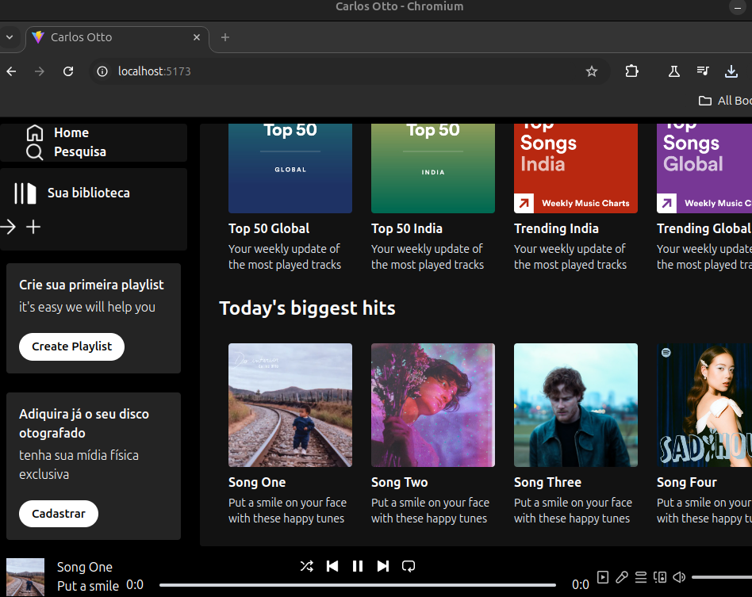

# spotify
Create Spotify Clone Using React JS &amp; Tailwind CSS  - Build Complete Music Website 



<div align="center">
  <h1>Tailwind React Spotify</h1>
  Starter pack for building performant e-commerce experiences with <a href="https://github.com/react">React</a>.
</div>

<div align="center">
  <a href="https://google.com">Website</a>
  <span> • </span>
  <a href="https://docs.google.com">Docs</a>
  <span> • </span>
  <a href="https://github.com/orgs/">Roadmap</a>
  <span> • </span>
  <a href="https://twitter.com/">Twitter</a>
  <span> • </span>
  <a href="https://discord.gg">Discord</a>
  <span> • </span>
  <a href="https:///">Demo</a>
</div>

<br/>

<div align="center">

[](https://github.com/orgs/saleor/projects/45/views/2)
[](https://discord.gg/H52JTZAtSH)

</div>

## Features

- **React 18**: File-based routing, Fast Refresh, Image Optimization and more.
- **App Router**: Uses React Server Components, Data Cache, and async components.
- **TypeScript**: Strongly typed codebase and GraphQL.
- **Customizable CSS**: TailwindCSS can be extended or replaced with an alternative CSS solution.

**Global:**

- Dynamic menu
- SEO data

**Checkout:**

- Single page checkout
- Portable to other frameworks

**My account:**

- Order history (coming soon)
- Order completion
- Order details

## Quickstart

### 1. Create Saleor backend instance
To quickly get started with the backend, use a free developer account at [Saleor Cloud](https://cloud.saleor.io/?utm_source=storefront&utm_medium=github).

Alternatively you can [run Saleor locally using docker](https://docs.saleor.io/docs/3.x/setup/docker-compose?utm_source=storefront&utm_medium=github).

### 2. Clone storefront

#### [Option 1] Using Comand line tools

Install or update to the latest version of the [Saleor CLI](https://docs.saleor.io/docs/3.x/cli) by running the following command:

```bash
npm create vite@latest
```

Clone storefront, install dependencies, and connect with the provided Saleor instance hostname

```bash
saleor storefront create --url https://{SALEOR_HOSTNAME}/graphql/
```

#### [Option 2] Manual install

Clone repository:
```bash
git clone https://github.com/saleor/storefront.git
```

Copy environment variables from `.env.example` to `.env`:

```bash
cp .env.example .env
```

Edit `.env` and set `NEXT_PUBLIC_SALEOR_API_URL` to your Saleor GraphQL endpoint URL, e.g., `https://example.saleor.cloud/graphql/`.

Then, [install `pnpm`](https://pnpm.io/installation) and run the following command to install all dependencies in the repo:

```bash
pnpm i
```

